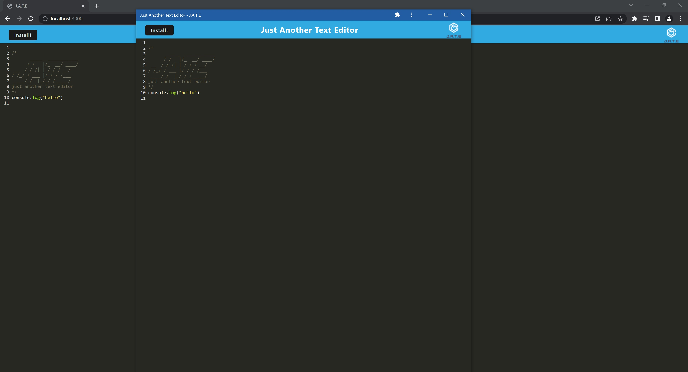

# PWA-Text-Editor

## Description

This project involved refactoring code to create a progressive web app text editor. When launched, this application will run in the browser, allow for text entries, and save to local storage. Additionally, it can be installed and ran offline as well.

## Installation

Navigate to [Heroku](https://pure-badlands-80872.herokuapp.com/), then click the install button to install locally. If on a Windows device, a desktop shortcut will be created and a link will appear in your Start menu.

This program may also be forked from [Github](https://github.com/rensyphon/PWA-Text-Editor), then installed by running `npm i` and `npm run start` in a source code editor terminal.

## Usage

Once the program is running—either online through a web browser or locally—simply enter text. The text will automatically be saved.

    ```md
    
    ```

## Credits

Original code and icons created by University of Arizona Full Stack Coding Boot Camp, 2022. https://bootcamp.ce.arizona.edu/coding/